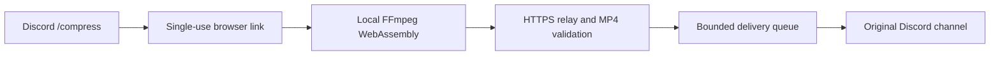

  

<h1 align="center">Professor Compressor</h1>

Browser-based video compression with automatic delivery to Discord.

  <a href="https://discord.com/oauth2/authorize?client_id=1550752400271351839&amp;permissions=277025426432&amp;integration_type=0&amp;scope=bot+applications.commands">Add to Discord</a>
  · <a href="https://professor-compressor.duckdns.org/">Website</a>
  · <a href="https://discord.com/invite/32RWwNWyEH">Support server</a>
  · <a href="docs/architecture.md">Architecture</a>

Professor Compressor helps people share videos that exceed a server's upload limit. A member runs `/compress`, opens a private browser link, and selects or drops up to 10 videos. They can add an optional short message to accompany the batch. The browser prepares MP4 files that fit the limit Discord reports for that server; the bot sends the results back to the original channel.

A server owner or member with **Manage Server** permission must add the bot to the server first. Installing the app only to a personal Discord account cannot deliver files back to a server channel.

## How it works

1. The bot creates a short-lived session for the requesting user and channel. Opening the link claims it for that browser. A refresh in the same browser can reopen the page, but local file selections must be made again.
2. The page checks file signatures and uses FFmpeg WebAssembly to probe and, when necessary, convert videos locally. Fitting MP4 files can skip re-encoding.
3. The browser uploads the resulting MP4 batch over HTTPS. The Python relay validates each file and delivers the batch as Discord attachments.
4. The relay releases the files from memory after delivery or failure. It does not intentionally write video files to disk.

The Discord bot token stays on the server. Videos that need conversion remain on the user's device until the resulting MP4 is ready. **A fitting MP4 may be uploaded unchanged**, so its original bytes can pass through the relay and Discord. This is not end-to-end encryption; the service operator and Discord can access files delivered through them.

## Engineering highlights

- **Browser-side video work.** FFmpeg WebAssembly does the expensive encoding on the user's device. Files are processed sequentially to limit browser memory use; a single-thread fallback covers browsers where the multithreaded core is unavailable.
- **Format-aware conversion.** FFmpeg probes the source rather than relying on the browser's ability to preview it. File signatures are checked instead of trusting extensions or MIME types. Duration-aware bitrate targeting aims below Discord's reported limit and retries oversized results.
- **Bounded delivery.** The relay applies per-address rate limits, upload concurrency limits, a queue limit, and an in-memory byte budget. Authenticated status polling and short-lived delivery receipts recover lost responses without resending an accepted batch. Prepared files can be saved or retried without recompression after a relay failure.
- **Short-lived access.** Upload links are random, expire, and can be claimed once. A short-lived, secure browser cookie permits same-browser refresh without making the claimed link public. Upload requests use a separate secret; refreshing revokes the previous page's secret. Active encoding renews a bounded session lease; idle links still expire.
- **Operational visibility.** Health and aggregate process metrics support monitoring without recording filenames or user, channel, server, or IP identifiers in the metrics. Private operator alerts include server details and the Discord username and user ID for compression sessions and outcomes. An owner-only `/botstats` command can show live server information in a configured private server.

The [architecture notes](docs/architecture.md) cover the request lifecycle, code boundaries, failure behavior, and scaling tradeoffs.

## Supported media and limits

Input containers include MP4/M4V, MOV, WebM, MKV, AVI, MPEG/MPG, OGV/OGG, FLV, TS/MTS/M2TS, 3GP/3G2, and WMV/ASF. The output is MP4. The codec inside a container must be supported by the bundled FFmpeg build; encrypted, damaged, audio-only, and unknown-duration sources may fail. The pinned encoder cannot convert AV1 sources. An MP4 sent without re-encoding may still have a codec a Discord client cannot play.

The selection limit is 10 videos. Browser memory, CPU, and background-tab throttling affect large or long files; the page must stay open until delivery finishes. The relay is currently one process with in-memory sessions and queues, so a restart clears unfinished work. It rejects excess traffic rather than accepting unbounded work.

## Verification

The repository includes Python tests for configuration, session and delivery behavior, HTTP routes, MP4 validation, and notifications. Browser tests run real FFmpeg WebAssembly against sample videos and cover conversion, the single-thread fallback, 10-file batches, drag and drop, invalid inputs, retries, and narrow layouts. GitHub Actions runs these checks, Python lint and formatting, dependency audits, and a production-container smoke test.

For maintainers, the test commands and development workflow are in [DEVELOPMENT.md](DEVELOPMENT.md). Local integration uses a separate development Discord application and a private `.env` with `DISCORD_TOKEN`. Browser tests simulate Discord delivery; a live `/compress` test is still needed to check deployed Discord permissions and delivery.

## Code map

| Path | Responsibility |
| --- | --- |
| `professor_compressor/application.py` | Discord commands, HTTP relay, delivery workers, and lifecycle |
| `professor_compressor/domain.py` | Upload jobs, delivery models, and job states |
| `professor_compressor/web_ui.py` | Browser interface and FFmpeg workflow |
| `professor_compressor/media_validation.py` | MP4 structure validation before delivery |
| `professor_compressor/config.py` | Environment parsing and bounds checks |
| `professor_compressor/notifications.py` and `metrics.py` | Operator alerts and aggregate counters |
| `tests/` and `.github/workflows/ci.yml` | Automated regression checks |

## Source and licensing

Copyright (c) 2026 Anthony Rama. All rights reserved in the original project code and documentation. The repository is published for viewing and review; no license to reuse, modify, distribute, or commercially exploit the original code is granted. Contact [Anthony Rama](mailto:professorcompressor.support@gmail.com) for permission. Rights granted by applicable law or GitHub's terms remain unaffected. Outside code contributions are not currently accepted.

Third-party components retain their own licenses. In particular, the FFmpeg WebAssembly cores declare GPL-2.0-or-later. See [third-party notices](THIRD_PARTY_NOTICES.md) for versions, license texts, source references, and distribution details.
