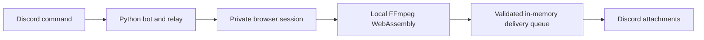

<div align="center">
  

  # Professor Compressor

  A privacy-focused Discord bot that compresses videos in the user's browser and sends the finished files back to Discord.

  [Invite Professor Compressor](https://discord.com/oauth2/authorize?client_id=1550752400271351839&permissions=277025426432&integration_type=0&scope=bot+applications.commands)
</div>

## What it does

Run `/compress` in a Discord server, open the private link, and choose up to 10 videos. Professor Compressor automatically formats the results to fit the upload limit Discord reports for that server.

When `BOTSTATS_GUILD_ID` is configured, the application owner or application
team members can run `/botstats` in that private server for an ephemeral live
server list and process-lifetime usage totals. The command is not registered in
other servers, defaults to administrators only, and still verifies the caller.

- Compression happens in the browser with FFmpeg WebAssembly.
- Videos needing compression are encoded locally; fitting MP4s may be sent unchanged.
- Compressed results are held briefly in server memory and relayed to Discord.
- Files are never written to disk by Professor Compressor.
- HTTPS is handled automatically by Caddy in the included Docker setup.
- Upload links are random, single-use, and expire after 10 minutes by default.
- A bounded Discord delivery queue, per-address rate limits, and relay
  concurrency limits protect the service from traffic spikes. Compression
  processing remains on the user's device.

Professor Compressor currently accepts video files and produces Discord-compatible MP4 files. It does not compress images, GIFs, PDFs, or other document types.

## How it works



See [Architecture](docs/architecture.md) for the full request lifecycle,
security boundaries, and scaling model.

1. A member runs `/compress` in a server channel.
2. The bot creates a private, single-use browser link. Opening it consumes the
   link and creates a browser-bound upload session.
3. The browser loads the self-hosted FFmpeg WebAssembly encoder.
4. The page validates each file's binary signature before videos are processed
   one at a time at up to 720p and 30 FPS.
5. Per-file progress, current-file position, elapsed time, output size, and
   reduction percentage remain visible throughout the run.
   The page requests a screen wake lock and warns when browser background
   throttling may slow active compression.
6. Finished MP4 files are sent to the relay over HTTPS with automatic retries.
7. The bounded relay queue posts the files to the original Discord channel and
   discards them from memory.

The Discord bot token is never exposed to the browser. Discord receives and stores the final attachments so server members can view them.

## Invite the hosted bot

Use the [official invite link](https://discord.com/oauth2/authorize?client_id=1550752400271351839&permissions=277025426432&integration_type=0&scope=bot+applications.commands). You must have permission to add apps to the destination server.

The bot requests only the channel permissions it needs:

- View Channels
- Send Messages
- Send Messages in Threads
- Attach Files
- Use Application Commands

## Run your own instance

### Requirements

- Python 3.11 or newer
- Node.js 22 and npm
- A Discord application and bot token
- A modern desktop browser

### Discord application setup

1. Create an application in the [Discord Developer Portal](https://discord.com/developers/applications).
2. Open the **Bot** page and create or reset the bot token.
3. Keep the token private. Never place it in source code or commit it to Git.
4. Under **OAuth2**, select the `bot` and `applications.commands` scopes.
5. Select the permissions listed above and use the generated URL to install the app to a server.

No privileged gateway intents are required.

### Local development

```bash
git clone https://github.com/Anthony-Rama/discord-bot.git
cd discord-bot

python3 -m venv .venv
source .venv/bin/activate
python -m pip install --upgrade pip
python -m pip install -r requirements.txt

npm ci
```

Create a private `.env` file in the project root using your editor:

```dotenv
DISCORD_TOKEN=your_development_bot_token
```

Use a separate development Discord application, not the token of a running
production bot. The `.env` file is excluded from Git and Docker build context.
Then start the bot:

```bash
python -m professor_compressor
```

For local testing, keep these defaults:

```dotenv
WEB_HOST=127.0.0.1
WEB_PORT=8080
PUBLIC_BASE_URL=http://127.0.0.1:8080
```

The private link will only open on the same computer when those local settings are used.

### Docker deployment

The included Compose configuration runs the bot behind Caddy with automatic HTTPS.

1. Point a domain's DNS record to your server.
2. Allow inbound TCP traffic on ports 80 and 443.
3. Install Docker Engine and Docker Compose.
4. Create a private `.env` file with `DISCORD_TOKEN=your_bot_token` and `DOMAIN=your-domain.example`, each on its own line. Replace both placeholders with your deployment values.
5. Start the services.

```bash
docker compose up --build -d
docker compose ps
docker compose logs -f bot
```

Check the service health at `https://your-domain.example/healthz`. Aggregate,
privacy-safe usage counters are available at
`https://your-domain.example/metricsz`.

The hosted legal documents required for Discord application verification are
available at `https://your-domain.example/privacy` and
`https://your-domain.example/terms`.

## Configuration

| Variable | Default | Purpose |
| --- | --- | --- |
| `DISCORD_TOKEN` | Required | Secret token from the Discord Developer Portal |
| `LOG_LEVEL` | `INFO` | Application log level |
| `ALERT_WEBHOOK_URL` | Empty | Optional private Discord webhook for install, removal, and `/compress` usage alerts |
| `DSC_API_TOKEN` | Empty | Optional secret token used to publish the current server count to dsc.sh |
| `DSC_STATS_INTERVAL_MINUTES` | `60` | Minutes between dsc.sh server-count updates; values below 30 are raised to 30 |
| `BOTSTATS_GUILD_ID` | Empty | Optional private server where the owner-only `/botstats` command is registered |
| `DOMAIN` | Required for Compose | Public DNS name used by Caddy |
| `WEB_HOST` | `127.0.0.1` | Address used by the Python web service |
| `WEB_PORT` | `8080` | Port used by the Python web service |
| `PUBLIC_BASE_URL` | `http://127.0.0.1:8080` | Base URL placed in private upload links |
| `ALLOWED_GUILD_IDS` | Empty | Optional comma-separated allowlist of Discord server IDs |
| `JOB_TTL_MINUTES` | `10` | Time allowed to open a private link |
| `ACTIVE_SESSION_TTL_MINUTES` | `30` | Time allowed to finish after opening it |
| `USER_COOLDOWN_SECONDS` | `15` | Delay before one user can create another link |
| `MAX_ACTIVE_JOBS` | `250` | Maximum number of active upload links |
| `MAX_RESULT_TOTAL_MIB` | `220` | Maximum combined in-memory result size per request |
| `UPLOAD_RATE_LIMIT_PER_MINUTE` | `8` | Open/upload attempts allowed per address per minute |
| `MAX_CONCURRENT_UPLOADS` | `2` | Result uploads accepted by the relay simultaneously |
| `DELIVERY_QUEUE_SIZE` | `8` | Maximum completed batches waiting for Discord |
| `DELIVERY_WORKERS` | `2` | Concurrent Discord delivery workers |
| `MAX_DELIVERY_BUFFER_MIB` | `400` | Maximum receiving, queued, and delivering result bytes in memory |

When `ALLOWED_GUILD_IDS` is empty, commands are available in every server that installs the bot. Set one or more server IDs to run a private instance:

```dotenv
ALLOWED_GUILD_IDS=123456789012345678,987654321098765432
```

To receive private operational alerts, create a webhook in an owner-only
Discord channel and set `ALERT_WEBHOOK_URL`. Alerts report installs, removals,
and accepted `/compress` sessions. They include the server name and ID, member
count for installation events, and aggregate process-lifetime counts. They do
not include usernames, channel names, filenames, IP addresses, or file content.
The webhook URL is a secret and must never be committed.

To keep the public dsc.sh listing current, set `DSC_API_TOKEN` to the private
token from the dsc.sh developer dashboard. The bot reports its server count at
startup, every hour by default, and after server joins or removals. The token is
a secret and must never be committed.

## Privacy and security

- Never commit `.env`. It is ignored by both Git and Docker builds.
- Reset the Discord bot token immediately if it is exposed.
- Original videos are processed locally in the browser.
- Finished videos travel through the relay in memory because the bot must attach them to Discord.
- Upload links contain high-entropy tokens, expire quickly, and can be opened
  only once. The claimed page receives a separate secret used for safe retries.
- Uploaded MP4 results must contain a structurally valid `ftyp`, `moov`, and
  `mdat` box sequence. Names and reported MIME types are not trusted.
- Per-address request limits, concurrent upload limits, and a bounded delivery
  queue prevent unbounded memory growth during traffic spikes.
- Security headers enable cross-origin isolation for multithreaded browser encoding and block framing, camera, microphone, location, and payment access.
- Runtime metrics are aggregate process counters only. They do not contain
  user IDs, server IDs, channel IDs, filenames, IP addresses, or file contents,
  and they reset whenever the process restarts.

## Quality checks

Every pull request and branch push runs GitHub Actions checks for linting,
formatting, generated browser JavaScript, HTTP routes and packaged assets,
Python compilation, dependency vulnerabilities, and a production Docker image
build.

Run the same core checks locally:

```bash
python -m unittest discover -s tests -v
python -m ruff check .
python -m ruff format --check .
python -m pip_audit --requirement requirements.txt
python -m compileall -q bot.py professor_compressor tests
npm ci
npx playwright install chromium
npm run test:browser
docker build --tag professor-compressor:local .
```

Browser tests require `ffmpeg` on PATH to generate test clips. They run a
loopback-only relay with Discord delivery replaced by a capture stub; no bot
token is required and no files are posted to Discord. Set `TEST_PYTHON` to your
virtualenv Python and optionally `CHROME_EXECUTABLE` to a local Chrome executable.
These tests exercise real WebAssembly compression, fallback, MOV conversion,
batching, cancellation, retry, and narrow-screen layout. A live `/compress`
smoke test is still required to verify deployed Discord permissions and delivery.

This design does not provide end-to-end encryption. The operator of a modified deployment and Discord can access the finished files. Review the code and host your own instance if that trust boundary does not meet your needs.

## Performance and limits

Browser FFmpeg is slower than native FFmpeg. Compression speed depends mainly on the user's computer, browser, video duration, and source resolution. The page must stay open and active until delivery finishes.

The practical input limit is the memory available to the browser tab. Videos are processed sequentially to reduce memory pressure. Very large files, older computers, and mobile browsers may fail or take a long time.

The included single-process relay is suitable for personal use and small
communities. Its queue and rate limits intentionally reject excess traffic
instead of exhausting memory. A large public deployment still needs a durable
external queue, shared state, monitoring, and multiple instances.

## Updating

```bash
git pull
docker compose up --build -d
docker compose ps
```

## Project structure

```text
professor_compressor/
  application.py      Discord commands, HTTP relay, and lifecycle wiring
  config.py           Typed environment parsing and validation
  domain.py           Upload state machine and delivery models
  notifications.py    Privacy-safe operator message formatting
  media_validation.py Dependency-free MP4 structural validation
  metrics.py          Aggregate process metrics without user identifiers
  web_ui.py           Browser FFmpeg workflow
  legal_pages.py      Privacy Policy and Terms of Service pages
  static/             Production branding assets
tests/                Unit tests for configuration and critical workflows
docs/                 Architecture and engineering documentation
.github/              CI and dependency-update configuration
bot.py                Compatibility entry point
compose.yaml          Production service definition
Caddyfile             HTTPS reverse proxy configuration
Dockerfile            Reproducible non-root production image
```

## License

No license has been granted yet. The source is public for inspection and personal evaluation. Add an explicit license before accepting outside contributions or redistributing modified versions.
