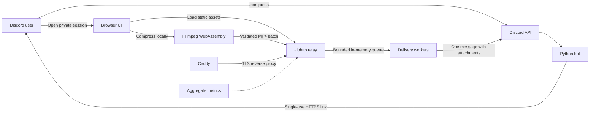

# Architecture

Professor Compressor keeps CPU-heavy video encoding in the user's browser.
The hosted service coordinates short-lived sessions and relays only completed
MP4 files to Discord.

## Trust and data boundaries

- Original videos stay inside the user's browser and are processed by FFmpeg
  WebAssembly.
- Finished MP4 files cross the HTTPS boundary and are held briefly in process
  memory while awaiting Discord delivery.
- The service does not write uploaded files to disk.
- Discord stores the final message attachments according to Discord's own
  policies.
- Session tokens are high entropy, short-lived, and single-use. Opening a link
  replaces it with a separate browser-bound claim secret.

## Request lifecycle

1. `/compress` creates an expiring upload job tied to the requesting user and
   channel.
2. The browser claims the one-use link and receives the compressor interface.
3. The browser checks file signatures and compresses selected videos locally.
4. Completed MP4 files are uploaded as one multipart batch with automatic
   retry.
5. The relay verifies MP4 structure and enforces file, batch, concurrency,
   memory, and rate limits.
6. A bounded worker queue sends every result in one Discord message and then
   releases the in-memory bytes.

## Operational model

The current deployment is intentionally single-process and uses in-memory
state. This keeps the small deployment simple, but it means sessions, queue
contents, and aggregate metrics disappear on restart. Horizontal scaling would
require shared session storage and a durable external queue.

`/healthz` reports readiness and current queue pressure. `/metricsz` reports
process-lifetime aggregate usage counters. Metrics never include user IDs,
guild IDs, channel IDs, filenames, IP addresses, or file contents.
