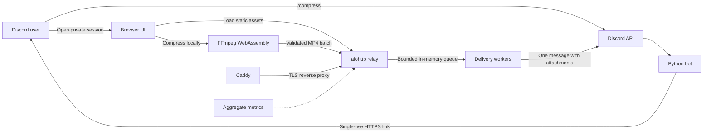

# Architecture

Professor Compressor keeps CPU-heavy video encoding in the user's browser.
The hosted service coordinates short-lived sessions and relays only completed
MP4 files to Discord.

## Trust and data boundaries

- Videos needing conversion or compression are processed by FFmpeg WebAssembly
  in the browser; their originals are not uploaded. Fitting MP4s may bypass
  recompression and be uploaded unchanged to the relay for Discord delivery.
- Finished MP4 files cross the HTTPS boundary and are held briefly in process
  memory while awaiting Discord delivery.
- The service does not write uploaded files to disk.
- Discord stores the final message attachments according to Discord's own
  policies.
- Session tokens are high entropy, short-lived, and can be claimed once. Opening
  a link creates a path-scoped, secure, HTTP-only browser cookie and a separate
  upload secret. A same-browser refresh rotates the upload secret; another
  browser cannot reuse the claimed link.

## Request lifecycle

1. `/compress` creates an expiring upload job tied to the requesting user and
   channel.
2. The browser claims the one-use link and receives the compressor interface.
3. The browser checks file signatures and compresses selected videos locally.
4. Completed MP4 files are uploaded as one multipart batch with automatic
   retry.
5. The relay verifies MP4 structure and enforces file, batch, concurrency,
   memory, and rate limits.
6. A bounded worker queue sends every result in one Discord message and then
   releases the in-memory bytes.

## Output size targeting

Fitting MP4s are sent unchanged. Other containers first try a compatible MP4
stream copy. Re-encoding uses one or two two-second CRF-18 samples per candidate
profile to estimate video complexity. Profiles preserve source dimensions and
frame rate where practical, with a browser encoding ceiling of 1080p/60 and no
upscaling. Resolution is preferred over additional frame rate. A 720p/30-or-lower
baseline gets priority when its budget exceeds 0.025 bits/pixel/frame; this is a
heuristic to avoid excessive downscaling, not a guarantee of visual quality.

If the sample estimate is comfortably below budget, a full CRF-18 encode is
attempted; it is retained only if the actual result fits the encoded-file ceiling.
Otherwise the browser uses two-pass H.264 encoding: an analysis pass learns the
whole clip's complexity, then an output pass allocates
bits across its frames. Both passes use identical frame timing and filters so
audio start offsets cannot introduce a different frame count in the MP4 pass.

The per-file ceiling is 98% of the session's Discord limit, capped further by
the relay's batch allowance divided by the number of selected files. The bitrate
budget reserves 1% of that ceiling for MP4 overhead and 96 kbps for audio only
when an audio stream exists (64 or 32 kbps for tightly constrained clips).
Resolution and frame rate may fall below 720p/30 when required; sources below
that baseline are not upscaled. There is no peak bitrate cap equal to the average
bitrate, which previously caused substantial undershooting on some clips.

The actual output size is always checked. An oversized result gets up to two
adjusted output passes using the same analysis statistics, and is rejected if it
still exceeds the ceiling. Simple content can remain smaller; bytes are never padded
to fill the allowance. Two-pass encoding adds processing time. Its statistics
stay in the browser's virtual filesystem and are cleaned up with preview/media
files. An encoder failure gets one automatic retry capped at 720p/30 to reduce
resource pressure. Higher-resolution sources are decoded and scaled; fitting
originals and stream-copy remuxes do not have this encoding ceiling. 4K encoding
is excluded from this initial policy after browser encoding failures in testing.
Extremely long files can still exceed the feasible bitrate budget and fail clearly
without sending an oversized file or requesting trimming.

## Operational model

The current deployment is intentionally single-process and uses in-memory
state. This keeps the small deployment simple, but it means sessions, queue
contents, and aggregate metrics disappear on restart. Horizontal scaling would
require shared session storage and a durable external queue.

`/healthz` reports liveness, release revision, and current queue pressure.
`/readyz` checks Discord, command synchronization, workers, and maintenance state.
`/metricsz` reports
process-lifetime aggregate usage counters. Metrics never include user IDs,
guild IDs, channel IDs, filenames, IP addresses, or file contents.

## Code boundaries

The runtime is organized as a Python package with intentionally narrow module
responsibilities:

- `config.py` is the only environment parsing boundary. It validates numbers,
  URLs, and Discord IDs, and prevents secret values from appearing in object
  representations.
- `domain.py` defines upload jobs, delivery requests, browser results, and the
  explicit job-state machine.
- `application.py` integrates Discord and aiohttp and owns process lifecycle.
- `web_ui.py` renders the browser compression client and serializes dynamic
  values safely into JavaScript.
- `media_validation.py` validates untrusted MP4 structure without trusting
  filenames or MIME headers.
- `notifications.py` formats operator messages with escaped Discord usernames
  and user IDs, but without channel names, filenames, IP addresses, session
  tokens, or file content.
- `metrics.py` provides locked, aggregate, process-lifetime counters.

The package root has no import-time startup behavior. The runtime token is
required only when the entry point starts the Discord client, so individual
components can be imported and tested without production credentials.

## Failure and overload behavior

The relay uses bounded concurrency, queue depth, and in-memory byte limits.
When any limit is reached, it returns a retryable response instead of accepting
unbounded work. A delivery request has one terminal success or failure result;
the worker releases its accounted bytes in a `finally` block. Browser failure
reports are authenticated with the claimed session secret and deduplicated
before they generate an operator alert. A browser-side failure does not consume
the session, so the page's retry action remains usable until the session
expires.

## Delivery recovery and expiration

The target is the normal bot-message allowance, not a user's Nitro interaction
allowance. The command checks effective channel permissions before creating a
link, and the worker checks permissions and the current bot allowance again
before sending. Threads have separate send permissions.

A HEAD inspection never claims a link. The first GET claims it; later GETs from
the same browser reopen the page while local encoding is active, but cannot
restore selected files. Refreshing during relay upload or Discord delivery shows
status only, so an accepted batch cannot be sent twice. Authenticated heartbeats
renew an active lease up to a two-hour total lifetime (or a longer configured
active-session lifetime). Idle sessions expire normally. A second command cannot
replace a live encoding or delivery; a confirmed page exit shortens the wait to
five seconds, while a lost exit signal leaves the lease to expire within 90
seconds. The command reports the remaining wait rather than a fixed estimate.

An accepted delivery is owned by the queue, not the browser connection. The HTTP
request waits briefly, then returns 202 if work is pending. The browser polls an
authenticated status endpoint. Queued work is not deleted by browser-session
expiry, and disconnecting does not cancel the worker. A lost success response is
recovered from a bounded one-hour receipt cache; duplicate uploads return that
receipt without sending another message. Receipts contain no media or filenames.
After receipt expiry or a process restart, a user must check Discord before
starting another session. Exactly-once delivery across process failure or an
ambiguous Discord API timeout is not guaranteed.

Prepared browser files survive recoverable upload failures until the page closes
or succeeds. Send-only retries use those files; optional local download links
allow recovery without another encoding pass. Nothing is downloaded automatically.

## Shutdown

HTTP starts independently of Discord command synchronization. Transient sync
failures retry while readiness stays false. On SIGTERM/SIGINT the process stops
accepting new sessions and drains active encoding leases, uploads, and deliveries
for at most 120 seconds. The configured container stop grace period is longer.
This reduces interruptions but is not persistent storage or zero-downtime deployment.
